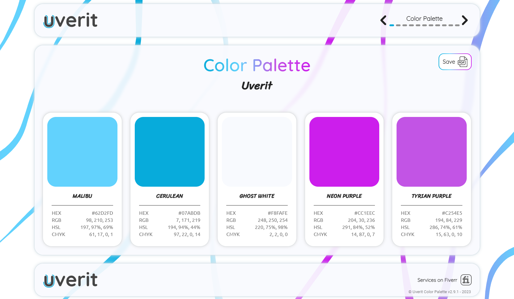
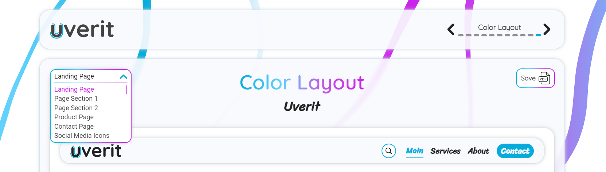

# Uverit Color Palette

## What is it?

Uverit Color Palette is a program used for a graphical showcase of a color palette and typefaces.

It allows for an easy and fast way to create a professional interactive color palette for different brands. The main purpose of the palette is to implement it on a website or other digital materials.

What sets this program apart is the ability to show an actual design that is possible to create using the palette. The user can see the elements change, hover over buttons, etc.

Each page can be exported to PDF or printed.

Every change is made in a single file and then applied to all pages. This allows for quick customization as well as enabling/disabling certain features.

[Link](https://newhorizonweb.github.io/Uverit-Color-Palette/)

## Color Palette and Typefaces

The Color Palette can be split into 2 parts - Color Palette and Typefaces.
Each part has its own pages that showcase a different aspects of the project.

The list of pages:
- Color Palette
- Color Meaning
- Color Chart
- Color Tones
- Color Saturation
- Color Gradient
- Color Tips
- Typefaces
- Type Specimens
- Character Sets
- Color Layout

The Color Palette is the main part of the program.

The Typefaces part contains Typefaces, Type Specimens and Character Sets pages. It can be enabled or disabled.

By enabling that option, the typefaces are changed across the whole project, like brand name, color names in the tiles (Color Palette page), and basically every paragraph / heading on the Color Layout page.

## Basic Navigation

Each page contains navigation, footer, PDF button, page name and brand name.

The user can navigate through the pages using arrows or "dots". When hovering over an arrow or a dot, the name of the page the user wants to go to is displayed.

The PDF button allows the download a PDF with the page content or print it.

## Pages

### Color Palette

It's the main page. There are 5 colors presented in the form of tiles.
Each tile contains:
- Color name (Main, Secondary, etc.)
- A large square with the color
- Color Palette color names (Cerulean, Malibu, etc.)
- Color models (each one os optional)
    - HEX
    - RGB
    - HSL
    - CMYK

The color values can be copied by clicking on them.

### Color Meaning

The main and accent colors are described here more deeply.
By defining the color type variables in the config file, the page allows for a better understanding of color choices.

There is a more general color name (type), fox example Cerulean is cyan.

The user can see a brief explanation / meaning of the colors, as well as a few keywords that summarize the emotions that the color represents.

### Color Chart

The page consists of a ring (donut) chart with all of the colors (the ratio was defined in the config file). This helps to visualize the color importance and proportions when applying color palette to the design.

There is also an explanation why it's important to keep everything balanced.

At the bottom of the page are the color ratio percentages.

### Color Tones

There are 2 sections - shades and tints.

Each of them is a grid of colors that have been changed to show the darker (shades) and lighter (tints) versions. It shows how some users can perceive the colors due to the screen brightness or helps to make design decisions (for example the designer can implement a lighter version of the color on hover).

### Color Saturation

Similar to Color Tones, but the sections are vivid (more saturated) and muted (less saturated).

This page is especially important for people with visual disabilities. The designer can better understand how some users may perceive the design. It helps to visualize which colors have more contrast (there is a grayscale - 0% saturation).

### Color Gradient

The page contains some gradients that are possible to create from the palette colors.

There are gradients such as:
- main - secondary
- accent - secondary accent
- main - accent
- secondary - secondary accent
- main - secondary - secondary accent - accent
- main - secondary - background - secondary accent - accent

### Color Tips

It's a list of DOs and DON'Ts, basic tips that help in the color palette implementation.
These are some general rules, but not a strict guide.

### Typefaces

There are 2 typefaces - main and secondary.
Each typeface has its own section with its name (shown using that typeface), short description and implementation guide.

Some typefaces are too wide and wouldn't fit (words moving to the second line or stretching the container they're in). This is why there is the "Big Font" feature in the config file. By enabling that option, the custom fonts are set to be smaller across the whole program. Two typefaces can have this feature enabled independently.

### Type Specimens

The page contains the same sentence displayed multiple times. Each one has a slightly different font to show how the typeface looks like in a different style (bold, italic, etc.) or size.

### Character Sets

The page contains every letter from the English alphabet (upper and lowe case), numbers 0-9 and a few special characters.

It's a great way to highlight differences between typefaces and show what individual characters look like.

### Color Layout

The most complex page of the program. There are multiple slides with a design proposition using the palettte colors and typefaces.

The user can choose the layout from the dropdown list in the upper left corner.

The slides are interactive, meaning that the user can hover over buttons, enter text, change pictures, etc.

Each slide is mobile-friendly, so the user can see how the design would look like on a mobile device.

#### Landing page

It's a basic landing page with navigation, hero section and footer.
The banners can be changed in the config file to better match the color palette theme.

#### Page Section 1

A simple, modern page section with two buttons, photo and some text.

#### Page Section 2

A little bit more complex page section design. The frosted glass covers blobs that show the main and accent colors.

#### Product Page

It mimics a classic online clothing store product page.

There's a photo gallery, product name, price, etc.
The user can choose the color, size and add the product to the cart.

#### Contact Page

It's a simple, medern contact page with contact info, social media buttons and a contact form.

The user can enter text and change service.

Inputs change their border color on hover and focus to better show the functionality of the palette.

#### Social Media Icons

It's a set of multiple social media icons/buttons. The user can hover over them and see multiple transitions and animations.

The designer can get inspired and implement some ideas on their own website.

## Customization

The "Config" is a TypeScript (JavaScript) file that contains a lot of features that can be changed using variables.

The list of customizable items:
- Color Palette
    - Dark Mode
    - Color Names (role of the color, such as main, accent, etc.)
    - Brand name
    - Colors (HEX)
        - Main
        - Secondary
        - Accent
        - Secondary Accent
        - Background
    - Color Palette Names
    - Color Ratio
    - Enabling color models
        - HEX
        - RGB
        - HSL
        - CMYK
    - Color Types (there are 35 defined color types)
        - Main
        - Accent
    - Banner (image on the Color Layout page, there are 4 banners)
- Typefaces (enable/disable)
    - Example text (Type Specimens page)
    - Enable/disable "Big Font"
    - Typefaces
        - Main
        - Secondary
    - Typeface names
        - Main
        - Secondary
    - Typeface descriptions
        - Main
        - Secondary

## Technologies

- Program
    - HTML 5
    - CSS 3
    - JavaScript
    - TypeScript 5.0.3

- Graphics & Icons
    - SVG
    - Adobe Illustrator
    - Adobe Photoshop

## License

Uverit Color Palette - All Rights Reserved.